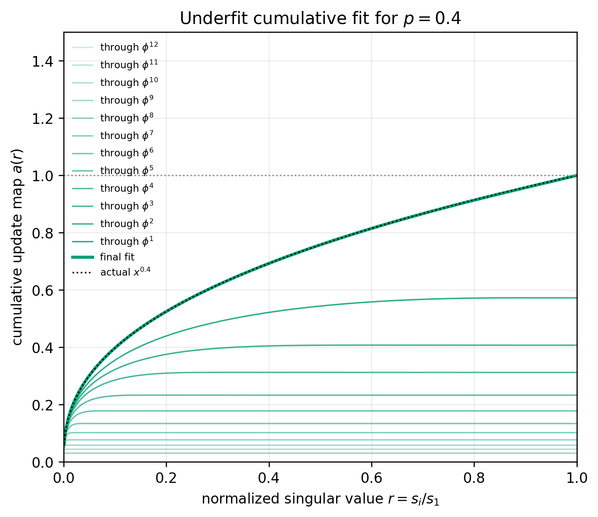
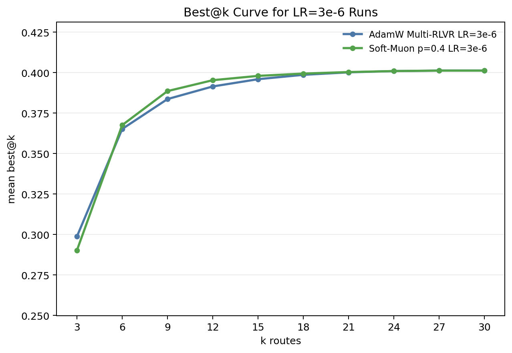

# RL Diversity with Soft-Muon

## Muon and diversity

The 2D weights `W` in a neural network or transformer represent linear mappings from input activations to outputs. Let `G` be the estimated gradient of the loss with respect to such a weight matrix. The SVD `sum_i s_i output_i input_i^T` of a matrix `G` decomposes it into weighted input-output relationships `s_i output_i input_i^T` where `s_i>0` is the corresponding singular value. Muon approximates the transformation of the gradient `G` where all the `s_i` are scaled to the same value. We can think of this as increasing the diversity of the learning signal instead of letting it be dominated by a few relationships `output_i input_i^T` with large singular value.

## Diversity collapse in RL

In RL we only get one reward signal per reponse (or a few in the case of VPO). Therefore the estimated policy gradient may not have enough information to estimate 1000s of input-output relationships, so the Muon update becomes dominated by noise. On the other hand collapse of diversity and exploration is a well-known issue that can arise in RL finetuning of LLMs, and methods such as [vector policy optimization (VPO)](https://arxiv.org/abs/2605.22817) seek to ameliorate this. We explore whether [Soft-Muon](https://nilin.github.io/contra-muon-and-soft-muon/) provides an alternative way to encourage diversity and exploration during RL, while being more robust to noisy policy gradients than full Muon.   

_Fixed p=0.4 Soft-Muon approximation built as a cumulative stack of standard Muon's Newton-Schulz iterates._

## Results

Best@k comparison for 7x7 Maze RLVR runs at learning rate 3e-6, excluding VPO and k=1.

[View the version including AdamW VPO at LR=3e-6](assets/best-at-k-lr3e-6-with-vpo.png).

_Mean best@k over route pools for AdamW Multi-RLVR and fixed-coefficient Soft-Muon p=0.4._

